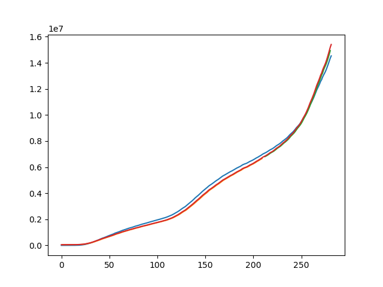
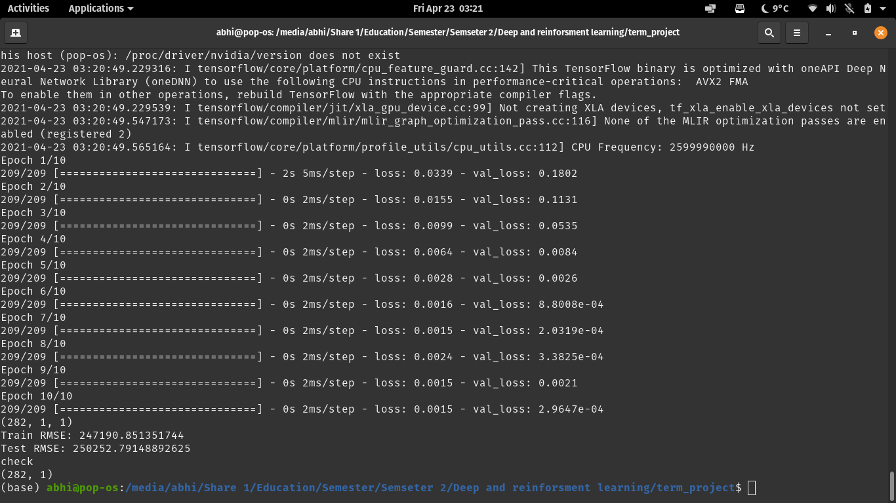

## Project Description - 

Covid cases are increasing day by day and in these unprecedented days it's very important to get a prediction of how much actual cases are going to increase and by how much rate. So we used the dataset that is available from the COVID-19 Tracking project and NYTimes. We build a Model that can predict the increasing COVID-19 rate. Using a LSTM sequential model. We trained the model to 500 epochs and the after some hyperparamater tuning the model gave very good results. 

### Dependencies - 

- Python, Pandas , Keras , Matplotlib and TensorFlow 
- Details - check requirement.txt

### Installation

```bash
git clone https://github.com/abhishekprakash256/Covid_Prediction_using_LSTM

cd Covid_Prediction_using_LSTM/

python3 main.py
```

### Results - 



### Validation - 

- For the validation of the results we use RMSE for test and train also we generated the graph for prediction and test comparison 



